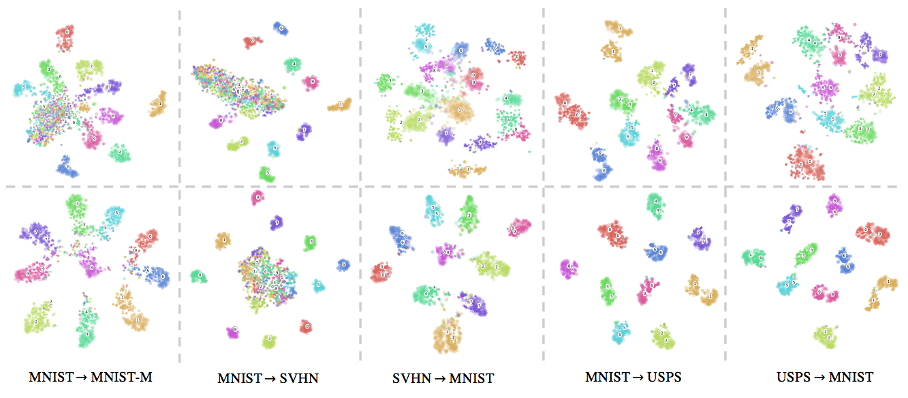

## Introduction
[](https://paperswithcode.com/sota/domain-adaptation-on-svnh-to-mnist?p=d-sne-domain-adaptation-using-stochastic)
[](https://paperswithcode.com/sota/domain-adaptation-on-office-31?p=d-sne-domain-adaptation-using-stochastic)
[](https://paperswithcode.com/sota/domain-adaptation-on-visda2017?p=d-sne-domain-adaptation-using-stochastic)

MXNet/Gluon implementation for [d-SNE: Domain Adaptation using Stochastic Neighbourhood Embedding](https://arxiv.org/abs/1905.12775), which was accepted at CVPR 2019 as oral presentation.
 d-SNE aims to perform domain adaptation by aligning the source domain and target domain in a class by class fashion. d-SNE is a supervised learning algorithm and requires a few labeled samples from the target domain for training. The semi-supervised extension can further improve its performance by incoporating unlabeled target data. 



## Prerequisites
### Dependencies
```bash
$ pip install -r requirements.txt

# Install the correct GPU version's mxnet
$ pip install mxnet-cu100 # for CUDA 10.0
```

### Datasets and abbreviations:
| Experiments | Datasets |
| ----------- |:--------:|
| Digits      | MNIST(MT), MNISTM(MM), SVHN(SN), and USPS(US)|
| Office-31   | AMAZON (A), DSLR (D), and WEBCAM (W)         |
| VisDA       | Synthetic (S) and Real (R)                   |

Due to licensing issues, we won't be able to host the datasets but provide the scripts to prepare the datasets for each experiment.
Please refer to the document: [how to pack dataset](docs/HOW_TO_PACK_DATASET.md).

## Few Shot Domain Adaptation with d-SNE 
### Digits Experiments: MT -> MM
Here, MNIST (MT) to MNISTM (MM) is used as an example here:
```shell script
$ python tools/train.py --cfg configs/DIGITS/MT-MM.yaml
```

## Change Logs
- [03/12/2020] Reshape the code with an experiment on MT-MM


# Reference
If you find any piece of this code or the paper useful, please cite our CVPR 2019 Oral paper:
```
@InProceedings{Xu_2019_CVPR,
    author = {Xu, Xiang and Zhou, Xiong and Venkatesan, Ragav and Swaminathan, Gurumurthy and Majumder, Orchid},
    title = {d-SNE: Domain Adaptation Using Stochastic Neighborhood Embedding},
    booktitle = {The IEEE/CVF Conference on Computer Vision and Pattern Recognition},
    month = {June 16-20},
    year = {2019},
    pages = {2497-2506}
}
```

